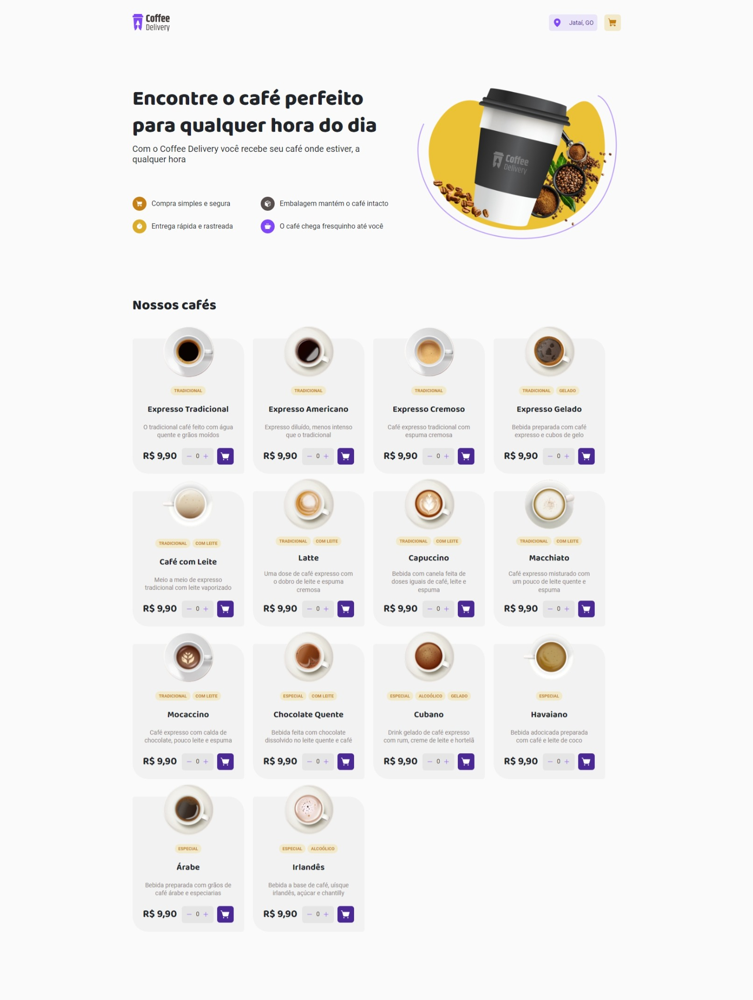
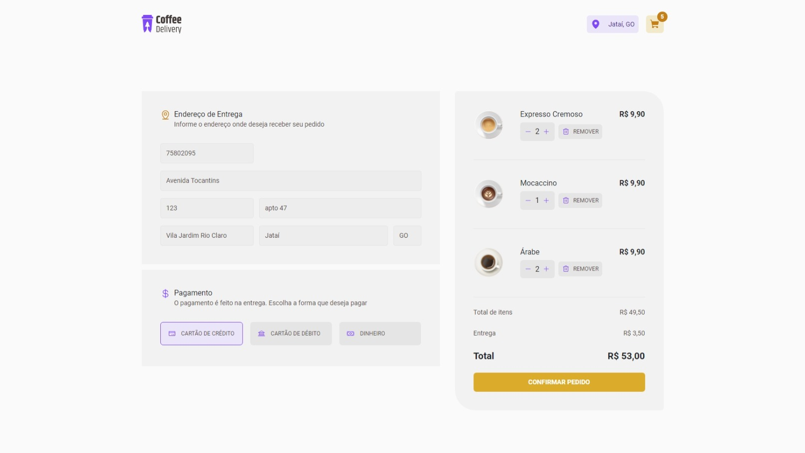
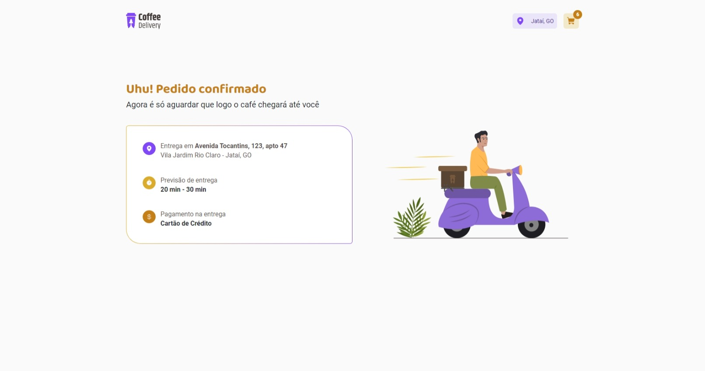

# ☕Coffee Deliver

## Desafio curso Reactjs - Ignite Rocketseat

## Aplicação para gerenciar um carrinho de compras de uma cafeteria fictícia, que contém as seguintes funcionalidades:

- [X] Listagem de produtos (cafés) disponíveis para compra
- [X] Adicionar uma quantidade específicas de itens no carrinho
- [X] Aumentar ou remover a quantidade de itens no carrinho
- [X] Formulário para o usuário preencher o seu endereço
- [X] Exibir o total de itens no carrinho no Header
- [X] Exibir o valor total da soma de itens no carrinho multiplicados pelo valor

### Tecnologias utilizadas durante desenvolvimento
- Vite
- React.js
    - Context API
    - useReducer
    - Router Dom
- Hook Form
- Zod
- Styled-Components
- Typescript
- Phophor-react


<div align="center" style="display: inline_block"><br>
  
  
  
  
  
  
  
</div>
<br>






# Install

Clone this repository and install it dependencies with this command:
```sh
$ npm install
```
Run the application with npm run dev command, it will start the app:
```sh
$ npm run dev
```